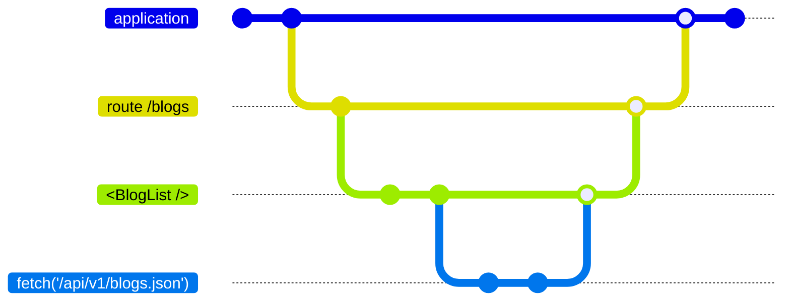

# What's a Resource?

<blockquote v-click class="big">
<h2>

A resource is a value with a lifetime and (optional) cleanup logic.

</h2>
</blockquote>

<div class="qr-code-list corner-br">
<QRCode value="https://www.starbeamjs.com/guides/fundamentals/resources.html"></QRCode>
(Starbeam)
<QRCode value="https://github.com/NullVoxPopuli/ember-resources/blob/main/docs/docs/README.md"></QRCode>
(ember-resources)
</div>


<!-- 

What is a resource?

!!click

It is a reactive function, yet represents a value. It is bound to a lifetime, and it may have cleanup.
-->

---
layout: center
transition: fade
---

# What does a resource look like?

<!-- 

What does a resource look like?

-->

---
layout: default
transition: fade
---

<div class="related-note">What does a resource look like?</div>
<br>
<br>

```gjs {all|4|5,7|12-14|9} 
import { resource, cell } from 'ember-resources';

const Clock = resource(({ on }) => {
	let time = cell(new Date());
	let interval = setInterval(() => time.current = new Date(), 1000);

	on.cleanup(() => clearInterval(interval));

	return time;
});

<template>
	It is: <time>{{Clock}}</time>
</template>
```

<div class="corner-br">
Live demo
<QRCode class="qr-code" size="240" value="https://tutorial.glimdown.com/2-reactivity/5-resources?showAnswer=1"></QRCode>
</div>

<!-- 

This is what they look like using ember-resources, 
which you can install today -- all the way back to ember 3.28, you can do this.

For this particular resource,

!! click

We create a value, a cell -- this represents the current DateTime

!! click

We can set up an interval, and clean up that interval when the resource is cleaned up by *whatever* the parent context may be. 

!! click

In this case, it's a small component.

!! click

Lastly the time is returned.
The renderer inherently knows how to render cells as their values.

-->

---
layout: default
transition: fade
---

<div class="related-note">What does a resource look like?</div>
<br>
<br>

```gjs 
import { resource } from 'ember-resources';

export const SomeResource = resource(() => {
    /* 
     * set up initial state
     * --------------------
     */

    /* 
     * optional cleanup
     * --------------------
     */

    /*
     * Return reactive cell or function that returns a value
     * --------------------
     */
});
```

<!-- 

This is the anatomy or layout of a Resource.

You set up initial state, 

(pause)  
provide optional cleanup

(pause)  
and then return the value.

-->

---
layout: default
transition: fade
---

<div class="related-note">What does a resource look like?</div>
<br>
<br>

```gjs {all|all|3} 
import { resource, resourceFactory } from 'ember-resources';

export const WorldClock = resourceFactory((locale, timeZone) => {
    /* ... */
    return resource(() => {
        /* ... */
    });
});
```

<br>

<div v-click="1">

```js 
import { Resource } from "@starbeam/universal";
 
export function WorldClock(locale, timeZone) {
    /* ... */
    return Resource(({ on }) => {
        /* ... */
    });
}
```

</div>

<!-- 

We can also configure arguments, and this is probably one of the bigger differences between
ember-resources and starbeam. 

!! click

Due how how ember's plain function invocation works, 

!! click

we need a wrapper function to handle receiving arguments.

It is intended to "just be a function" though 

there is nothing magic going on here that a user of this would need to be concerned about.


When Resources land natively in ember this wrapping "resourceFactory" won't be needed. 

-->

---
layout: center
transition: fade
---

# Resources have a lifetime

<div v-click>



</div>


<!-- 

So resources have a lifetime -- what's a lifetime?

!! click

An application has a lifetime, it has a start and an end.
During testing, oftentimes, you have one application lifetime per test


You could visit a route during the lifetime of your application.
It could be thought of as having its own lifetime,
as would the components the rendered within.

This recurses all the way through the rendering tree.

!! prepare to mouse / point at the bottom lifetime

Along and within that rendering tree, 
we may have a Resource that fetches data for this route


When the parent lifetime ends, so do its descendants.

-->

---
layout: center
transition: fade
---


# Resources (can) have cleanup


<!-- 

Cleanup is useful for cleaning up event listeners, 
cancelling observers, timers, disconnecting from websockets, 
maybe freeing up memory -- bunch of things we could clean up.

-->

---
layout: center
transition: fade
---

<div class="related-note">Resources (can) have cleanup</div>

```js
import Component from '@glimmer/component';
import { registerDestructor } from '@ember/destroyable';

class Modal extends Component {
  constructor(owner, args) {
    super(owner, args);

    let abortController = new AbortController();

    fetch('...', { 
        signal: abortController.signal 
    }).then( /* ... */ );

    registerDestructor(this, () => abortController.abort());
  }

  willDestroy() {}
}
```

<!-- 

This is a concept we're likely used to.
Components, Modifiers, class-based-helpers, 
all have a `willDestroy` method.


If you're the type of person who likes using features as they are released in the framework, you may have seen at-ember-destroyable. 

Cleanup is co-located with setup. 

... but we can do better... which we'll get to!

-->

---
transition: fade
layout: center
---

# Resources are automatically linked


<!-- 

When working with the framework, we need to hook in the owner, 

and set up the destroyable relationships.

If you've ever done this yourself, it's *a* . *lot* . *of* . *work*


-->

---
transition: fade
layout: center
---

<div class="related-note">Resources are automatically linked</div>

```js 
import { setOwner, getOwner } from '@ember/owner';
import { associateDestroyableChild } from '@ember/destroyable';

class Demo extends Component {
    @cached 
    get myInstance() {
        let instance = new MyClass({
            foo: () => this.args.foo,
        });

        setOwner(instance, getOwner(this));

        associateDestroyableChild(this, instance);

        return instance;
    }

}

```

<!-- 

Here is what the code looks like if you wanted to link up a 
custom class to a component, so that it gets the owner, and 
has its destroyable method called when the component is torn down./

We don't want to do this! This is a lot of boilerplate! 

Resources do this for us.

-->


---
transition: fade
layout: center
---

<div class="related-note">Resources (can) have cleanup</div>


```js
import { resource } from 'ember-resources';

const Fetch = resource(({ on }) => {
    let abortController = new AbortController();

    fetch('...', { 
        signal: abortController.signal 
    }).then( /* ... */ );

    on.cleanup(() => abortController.abort());

    /* ... */
});
```

<!-- 

Resources have more ergonomic cleanup 


it is co-located with the behavior, 
which is a goal that willDestroy methods did not care about.


-->

