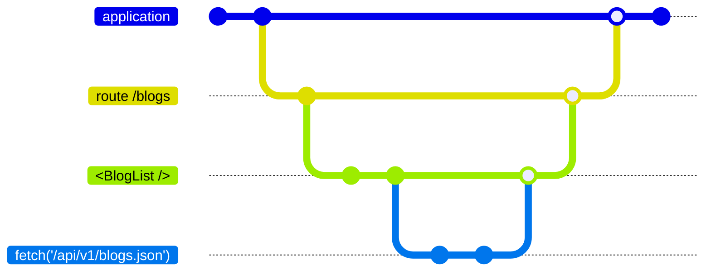

# Resources have a lifetime

<div v-click>



</div>


<!-- 

So resources have a lifetime -- what's a lifetime?

!! click

An application has a lifetime, it has a start and an end.
During testing, oftentimes, you have one application lifetime per test


You could visit a route during the lifetime of your application.
It could be thought of as having its own lifetime,
as would the components the rendered within.

This recurses all the way down the rendering tree --
well.. on this slide, an upside rendering tree.

Along and within that rendering tree, 
we may have a Resource that fetches data for this route


When the parent lifetime ends, so do its descendants.

-->

---
layout: center
---


# Resources (can) have cleanup

```js
import { registerDestructor } from '@ember/destroyable';

class Modal extends Component {
  constructor() {
    let abortController = new AbortController();
    fetch('...', { signal: abortController.signal })
        .then( /* ... */;

    registerDestructor(this, () => abortController.abort());
  }
}
```

```js
const Fetch = resource(({ on }) => {
    let abortController = new AbortController();
    fetch('...', { signal: abortController.signal })
        .then( /* ... */;

    on.cleanup(() => abortController.abort());
})
```


<!-- 

This is a concept we're likely used to.
Components, Modifiers, class-based-helpers, 
all have a `willDestroy` method.

If you're the type of person who likes using features as they are released in the framework, you may have seen at-ember-destroyable. 

Resources have more ergonomic cleanup 

-->

