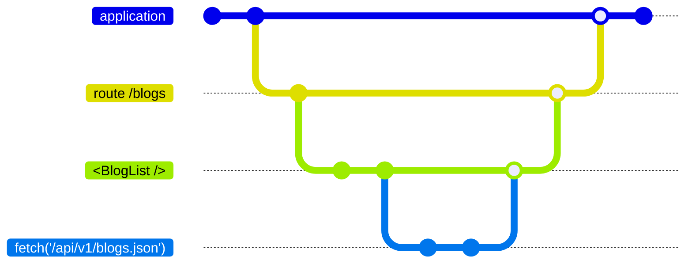

# What's a Resource?

<blockquote v-click class="big">
<h2>

A resource is a value with a lifetime and (optional) cleanup logic.

</h2>
</blockquote>

<div class="qr-code-list corner-br">
<QRCode size="200" value="https://www.starbeamjs.com/guides/fundamentals/resources.html">
Starbeam
</QRCode>
<QRCode size="200" value="https://github.com/NullVoxPopuli/ember-resources/blob/main/docs/docs/README.md">
ember-resources
</QRCode>
</div>


<!-- 

What is a resource?

!!click


It is a "Unification of **a lot** of concepts"

- In Ember, they _rationalize_ class-based-helpers, modifiers, services, and routing.
- Outside Ember, they rationalize hooks and effects.
- The allow you to derive data in ways that previously would need effect-like behavior

A resource is a reactive function, yet represents a value. 

It is bound to a lifetime and may have cleanup.

-->

---
layout: center
transition: fade-out
---

<div class="slide-category">What's a Resource?</div> 

# What does a resource look like?

<!-- 

What does a resource look like?

-->

---
layout: default
transition: fade
---

<div class="slide-category">What's a Resource?</div> 
<div class="related-note">What does a resource look like?</div>
<br>
<br>

```gjs {all|4|5,7|12-14|9} 
import { resource, cell } from 'ember-resources';

const Clock = resource(({ on }) => {
	let time = cell(new Date());
	let interval = setInterval(() => time.current = new Date(), 1000);

	on.cleanup(() => clearInterval(interval));

	return time;
});

<template>
	It is: <time>{{Clock}}</time>
</template>
```

<div class="corner-br">
<QRCode class="qr-code" size="240" value="https://tutorial.glimdown.com/2-reactivity/5-resources?showAnswer=1">Live demo</QRCode>
</div>

<video 
  controls loop 
  autoplay
  style="position: fixed; bottom: 1rem; left: 1rem;"
  src="/pages/primitives/examples/clock.webm"></video>

<!-- 

This is what they look like when using ember-resources, 
which you can install today -- all the way back to ember 3.28, you can do this.

For this particular resource,

!! click

We create a value, a cell -- this represents the current DateTime

!! click

We can set up an interval, and clean up that interval when the resource is cleaned up by *whatever* the parent context may be. 

!! click

In this case, it's a small component.

!! click

Lastly the time is returned.
The renderer inherently knows how to render cells as their values.

-->

---
layout: default
transition: fade
---

<div class="slide-category">What's a Resource?</div> 
<div class="related-note">What does a resource look like?</div>
<br>
<br>

```gjs 
import { resource } from 'ember-resources';

export const SomeResource = resource(() => {
    /* 
     * set up initial state
     * --------------------
     */

    /* 
     * optional cleanup
     * --------------------
     */

    /*
     * Return reactive cell or function that returns a value
     * --------------------
     */
});
```

<!-- 

This is the anatomy or layout of a Resource.

You set up initial state, 

(pause)  
provide optional cleanup

(pause)  
and then return the value.

-->

---
layout: default
transition: fade
---

<div class="slide-category">What's a Resource?</div> 
<div class="related-note">What does a resource look like?</div>
<br>
<br>

```gjs {all|all|3} 
import { resource, resourceFactory } from 'ember-resources';

export const WorldClock = resourceFactory((locale, timeZone) => {
    /* ... */
    return resource(() => {
        /* ... */
    });
});
```

<br>

<div v-click="1">

```js 
import { Resource } from "@starbeam/universal";
 
export function WorldClock(locale, timeZone) {
    /* ... */
    return Resource(({ on }) => {
        /* ... */
    });
}
```

</div>

<!-- 

We can also configure arguments, and this is probably one of the bigger differences between
ember-resources and starbeam. 

!! click

Due how how ember's plain function invocation works, 

!! click

we need a wrapper function to handle receiving arguments.

It is intended to "just be a function" though 

there is nothing magic going on here that a user of this would need to be concerned about.


When Resources land natively in ember this wrapping "resourceFactory" won't be needed. 

-->

---
layout: center
transition: fade
---

<div class="slide-category">What's a Resource?</div> 


# Resources (can) have cleanup


<!-- 

Cleanup is useful for cleaning up event listeners, 
cancelling observers, timers, disconnecting from websockets, 
maybe freeing up memory -- bunch of things we could clean up.

-->

---
layout: center
transition: fade
---

<div class="slide-category">What's a Resource?</div> 
<div class="related-note">Resources (can) have cleanup</div>

```gjs {all|7} 
import { resource, cell } from 'ember-resources';

const Clock = resource(({ on }) => {
	let time = cell(new Date());
	let interval = setInterval(() => time.current = new Date(), 1000);

	on.cleanup(() => clearInterval(interval));

	return time;
});

<template>
	It is: <time>{{Clock}}</time>
</template>
```

<!-- 
So far, we've been looking at a Clock example

!!click

where the interval needs to be cleaned up.

Let's take a look at another situation which may need cleanup.

-->

---
layout: center
transition: fade
---

<div class="slide-category">What's a Resource?</div> 
<div class="related-note">Resources (can) have cleanup</div>

```js
import Component from '@glimmer/component';

class Modal extends Component {
  constructor(owner, args) {
    super(owner, args);

    this.abortController = new AbortController();

    fetch('...', { 
        signal: this.abortController.signal 
    }).then( /* ... */ );
  }

  willDestroy() {
    this.abortController.abort();
  }
}
```

<!-- 

Cleanup, in general, is a concept we're likely used to.
Components, Modifiers, class-based-helpers, 
all have a `willDestroy` method.


-->

---
layout: center
transition: fade
---

<div class="slide-category">What's a Resource?</div> 
<div class="related-note">Resources (can) have cleanup</div>

```js
import Component from '@glimmer/component';
import { registerDestructor } from '@ember/destroyable';

class Modal extends Component {
  constructor(owner, args) {
    super(owner, args);

    let abortController = new AbortController();

    fetch('...', { 
        signal: abortController.signal 
    }).then( /* ... */ );

    registerDestructor(this, () => abortController.abort());
  }
}
```

<!-- 

If you're the type of person 
who likes using features as they are released in to the framework, 

you may have seen at-ember-destroyable. 

Cleanup is co-located with setup. 

This is an improvement...

... but we can still do even better... 

-->

---
transition: fade
layout: center
---

<div class="slide-category">What's a Resource?</div> 
<div class="related-note">Resources (can) have cleanup</div>


```js
import { resource } from 'ember-resources';

const Fetch = resource(({ on }) => {
    let abortController = new AbortController();

    fetch('...', { 
        signal: abortController.signal 
    }).then( /* ... */ );

    on.cleanup(() => abortController.abort());

    /* ... */
});
```

<!-- 

Resources have more ergonomic cleanup 

it is co-located with the behavior, 
which is a goal that willDestroy methods didn't know to care about.

there are no additional imports, 
which leads to better intellisense and editor assistance
around this API.


-->

---
layout: center
transition: fade
---

<div class="slide-category">What's a Resource?</div> 

# Resources have a lifetime

<!-- 

So resources have a lifetime -- what's a lifetime?

-->

---
layout: center
transition: fade
---

<div class="slide-category">What's a Resource?</div> 
<div class="related-note">Resources have a lifetime</div>

<div style="transform:scale(1.2)">



</div>


<!-- 

An application has a lifetime, it has a start and an end.
During testing, oftentimes, you have one application lifetime per test

It may even be a stripped down lifetime -- only what's needed for rendering a component.


But, You could visit a route during the lifetime of your application.

That route could be thought of as having its own lifetime,
as would the components rendered within that route.

This recurses all the way through the rendering tree.

!! prepare to mouse / point at the bottom lifetime

Along and within that rendering tree, 
we may have a Resource (or it could be a component or .. something) that fetches data for this route


When the parent lifetime ends, so do its descendants.

-->


---
transition: fade-out
layout: center
---

<div class="slide-category">What's a Resource?</div> 

# Resources are automatically linked


<!-- 

When working with the framework, 
we often need to hook in the application owner for access to services...,

and set up the destroyable relationships to the **appropriate lifetime.**

If you've ever done this yourself, it's *a* . *lot* . *of* . *work*


-->

---
transition: fade
layout: center
---

<div class="slide-category">What's a Resource?</div> 
<div class="related-note">Resources are automatically linked</div>

```js {all|5|11|13|all} 
import { setOwner, getOwner } from '@ember/owner';
import { associateDestroyableChild } from '@ember/destroyable';

class Demo extends Component {
    @cached 
    get myInstance() {
        let instance = new MyClass({
            foo: () => this.args.foo,
        });

        setOwner(instance, getOwner(this));

        associateDestroyableChild(this, instance);

        return instance;
    }

}
```

<!-- 

Here is what the code looks like if you wanted to link up a 
custom class to a component, so that it gets the owner, and 
has its destroyable method called when the component is torn down.

!! click

we have at-cached

!! click 

we have setOwner and getOWner

!! click

we have associateDEstroyableChild

!! click

We don't want to do this! This is a lot of boilerplate! 

Resources do this for us.

-->

---
transition: fade
layout: two-cols
---

<div class="slide-category">What's a Resource?</div> 
<div class="related-note">Resources are automatically linked</div>

<br>

::left::

```js {all|2|all} 
const MyResource = resourceFactory((foo) => {
    return resource(({ owner, on }) => {
        on.cleanup(() => { /* ... */ });
        /* ... */
    });
});
```

::right::

<div v-click="2">

```gjs 
import { MyResource } from "./my-resource";

<template>
    {{#if @maybeTrue}}
        {{MyResource @foo}}
    {{/if}}
</template>
```

</div>
<div v-click="3">

```gjs

export default class Demo extends Component {
    myResource = 
      use(this, MyResource(() => this.args.foo));

    <template>
        {{this.myResource}}
    </template>
}
```


</div>

<!-- 

When we use a resource 

!!click

- it automatically has an owner

!! click

- we get linked template invocation for free

!! click

- and it automatically has the correct destroyable association regardless of where it is used. 

So when it's used in a 

template-block, a component, within another resource, or a service, 

and that parent 

template-block, component, resource or service is destroyed, 

so will that resource be also destroyed.

-->


---
transition: fade-out
layout: center
---

<div class="slide-category">What's a Resource?</div> 

# Resources compose 


<!-- 

Resources can easily be composed together, 

they abstract away the details and inner-workings of the framework that would otherwise be exposed to your apps.


-->


---
transition: fade
layout: center 
---

<div class="slide-category">What's a Resource?</div> 
<div class="related-note">Resources compose</div>


```js {all|all|} 
const Now = resource(({ on }) => {
   const now = cell(new Date());
   const interval = setInterval(() => now.current = new Date(), 1000);

   on.cleanup(() => clearInterval(interval));

   return now;
})
```

<div v-click="1">

```gjs {all|8-12|9|14-16}
const formatter = new Intl.DateTimeFormat("en-US", {
  hour: "numeric",
  minute: "numeric",
  second: "numeric",
  hour12: false,
});

const FormattedNow = resource(({ use }) => {
    const now = use(Now);

    return () => formatter.format(now.current);
});

<template>
    {{FormattedNow}} is formatted {{Now}}
</template>
```

</div>

<!-- 

Using our resource that represents the current time, Now.

!!click 

we can define a new resource, FormattedNow, 

!!click (twice, because sli.dev is buggy)

we can _compose_ Now via the `use` function.

!! click

And it renders in a component the exact same way 


-->
